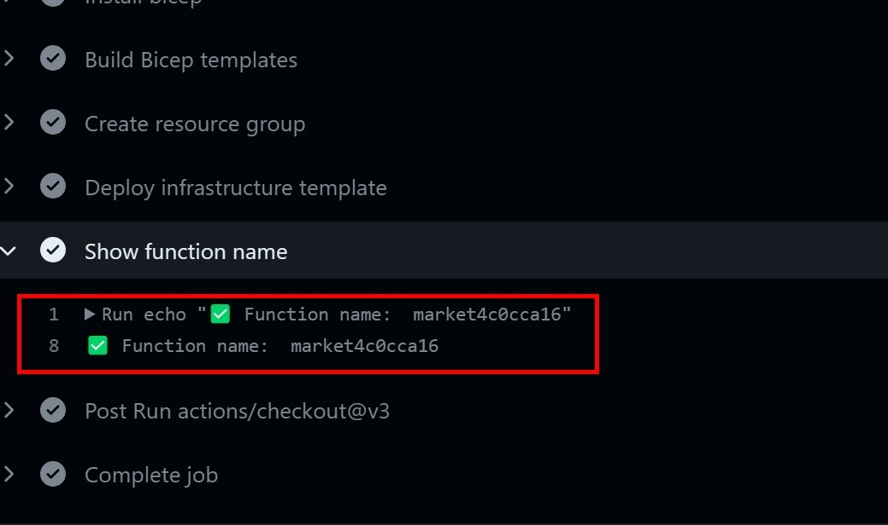

# Overview

This repository contains two Azure Function applications designed to help Managed Application solution owners in Partner Centre monitor and manage their deployed apps.

The first app, Notification Endpoint, captures events triggered during customer deployment and saves managed app information into an Azure storage table, allowing solution owners to build analytics and alerts on top of this data.
For further information about each function, please refer to the [README file](https://github.com/Azure/marketplace-management/blob/feedback/applications/README.md) located in the `applications` directory.

The second app, Policy States Collector, automates monitoring of Azure policies for compliance by querying the latest state of Azure policies in managed applications, filtering and sending the data to the Policy Monitor table in the Log Analytics Workspace for real-time monitoring. The app also includes a Scheduled Query Rule Alert that monitors non-compliant policies and triggers an Action Group for notification when an issue is detected.

Please note that these applications are an extra tool for publishers and is not required for using Managed Applications. Additionally, there are starter applications and can be customized according to your needs. The solution is part of Marketplace examples (add link later)

## Repository content

Within this repository, you can find the following directories:

- `.github/workflows`: automated workflows to deploy infrastructure and code.
- `azure`: infrastructure templates that deploy the Azure components needed to support applications.
- `applications`: code and documentation describing each application in more details.

## Get it up and running

This project is a starting point to monitor your Managed Application offer created in [Partner center](https://partner.microsoft.com/), assuming that you have already created your offer. Use the guidance below.

> :warning: **Please make sure you deploy the Notification Endpoint before you publish your managed app offer. Otherwise, you will need to republish the offer again with configuration of the Notification Endpoint URL.**

### Prerequisites

The deployment of the azure function requires a series of actions to set up the environment, including the creation of a Marketplace [Managed Application service principal](https://learn.microsoft.com/en-gb/partner-center/marketplace/plan-azure-app-managed-app#choose-who-can-manage-the-application), an Azure service principal, configuring the necessary GitHub secrets and variables, and deploying the code.

### Create the Azure Service Principal

Follow these steps to create a Service Principal with the `Owner` role scoped to the target Platform subscription. This Service Principal will be used by a GitHub-owned runner to authenticate to Azure and deploy the Azure function infrastructure.

- Log in to the required Azure Active Directory Tenant using the Azure CLI on your local device or via [Azure Cloud Shell](https://shell.azure.com):  
`az login --tenant [Tenant ID]`
- Select the target Platform subscription, inserting the Subscription ID where indicated:   `az account set --subscription [Subscription ID]`
- Create the Service Principal, providing an identifying name where indicated:   `az ad sp create-for-rbac --name [SP Name] --query "{ client_id: appId, client_secret: password, tenant_id: tenant }"`
- Capture the values of **client_id**, **client_secret** and **tenant_id** for later use. It is recommended that you do not persist this information to disk or share the client secret for security reasons.
- Grant the Service Principal "Owner" role on the target Platform subscription:   `az role assignment create --assignee [SP Client ID] --role "Owner" --scope /subscriptions/[Subscription ID]`

### Configure the Managed Application service principal

This Service Principal will be used by Azure function applications (NotificationHandler and PolicyStates) to authenticate against customers' deployments and fetch needed Managed app information.

- Create another Service principal by using instructions from previous step [Create Azure Service Principal](#create-the-azure-service-principal) section without the last step (granting the Service Principal owner role).

- Link this Service principal in Partner center by going to [Partner center](https://partner.microsoft.com/) and then Navigate to **your offer** > **your managed plan** > **Plan overview** > **Technical configuration**

- In `Authorizations` section click on `Add authorizations`. Use `Object ID` from previous step and choose the `Owner role`

### Create secrets and variables

For each of the secrets defined in the table below, follow these steps to add each secret and variables the corresponding value.

- Navigate to **your github repo** > **Settings** > **Secrets and variables** > **New repository secret**

- Add the secret name and value, taking care to use the exact secret name provided as this is explicitly referenced in the GitHub workflow.

| Secret Name              | Example Value                        | Description |
| ------------------------ | ------------------------------------ | ----------- |
| SUBSCRIPTION_ID | 3edb65d1-d7a8-409b-a320-3c01ac6825f9 | Subscription ID where infra will be deployed. |
| CLIENT_ID    | 9505fb9a-96e6-46d1-ac9b-2f74ee57f6d6 | Client ID from the [Create the Azure Service Principaln](#create-the-azure-service-principal) |
| CLIENT_SECRET | [secure string] | Client Secret from the [Create the Azure Service Principal](#create-service-principal) |
| TENANT_ID    | f7d23806-d8ac-4576-814f-0ee931ffeab3 | Azure AD Tenant ID from the [Create the Azure Service Principal](#create-the-azure-service-principal) |
| SP_CLIENT_ID    | 9505fb9a-96e6-46d1-ac9b-2f74ee57f6d6 | Manage app Client ID from the [Configure the Managed Application service principal](#configure-the-managed-application-service-principal) |
| SP_CLIENT_SECRET | [secure string] | Managed app Client Secret from the [Configure the Managed Application service principal](#configure-the-managed-application-service-principal) |

- Navigate to **Settings** > **Secrets and variables** > **variables** > **New repository variables**

- Add the varible name and value, taking care to use the exact secret name provided as this is explicitly referenced in the GitHub workflow.

| Varible Name              | Example Value                        | Description |
| ------------------------ | ------------------------------------ | ----------- |
| APP_NAME                   | marketplace | Azure function name |
| LOCATION | northeurope | Location of infra resources |
| RESOURCE_GROUP_NAME    | marketplace-manage-applications | RG name |
| STORAGE_ACCOUNT_TABLE_NAME | applications | name of Table for storing Manage app details in Azure storage |
| SUBSCRIPTION_NAME    | [string] | Subscription name where infra will be deployed |
| EMAIL_ADDRESS    | [string] | Email address for the alert notification when policies become non-compliant  |
| RECEIVERS_NAME    | [string] | The receiver's name to who the alert is sent  |

### Run the workflows

Follow these steps to run workflows which will deploy the infrastructure and code.

- Navigate to **Actions** -> **Infrastructure deployment**
- Click **Run workflow**
- Ensure the desired branch is selected, e.g. **main**
- Click the **Run workflow** button
- Copy function name from logs in `Show function name` step after the `Infrastructure deployment` workflow is finished

- Navigate to `Code deployment` workflow to run the second one. Paste the function name in the input

Once the function is deployed, you can configure the Managed Application to use the Notification Endpoint URL. You can do this by following these steps:

- Open the Managed Application in [Partner center](https://partner.microsoft.com/)
- Navigate to **your offer** > **your managed plan** > **Plan overview** > **Technical configuration**
- Enter the Notification Endpoint URL, which is the URL of the Azure Function that you created.
Save the changes.

- Publish / republish your plan

### Confirm Azure function applications are running successfully

Once all Workflows have completed, navigate to Resource group `marketplace-manage-applications`. Select Azure function and click on `Functions`. You should see `NotificationHandler` and `PolicyStates`. Each functions has logs that can indicate the status. You can find them in `Monitor` section.

When you deployed the Manage application, you should be able to find its details in the Azure storage table.  
You can also see policy states in Log Analytics by using `PolicyComplianceStates_CL` query.
Only note they will be visible after some time after function gets triggered.
If policies become non-complaint, you should get the email notification.

## Contributing

This project welcomes contributions and suggestions.  Most contributions require you to agree to a
Contributor License Agreement (CLA) declaring that you have the right to, and actually do, grant us
the rights to use your contribution. For details, visit <https://cla.opensource.microsoft.com>.

When you submit a pull request, a CLA bot will automatically determine whether you need to provide
a CLA and decorate the PR appropriately (e.g., status check, comment). Simply follow the instructions
provided by the bot. You will only need to do this once across all repos using our CLA.

This project has adopted the [Microsoft Open Source Code of Conduct](https://opensource.microsoft.com/codeofconduct/).
For more information see the [Code of Conduct FAQ](https://opensource.microsoft.com/codeofconduct/faq/) or
contact [opencode@microsoft.com](mailto:opencode@microsoft.com) with any additional questions or comments.

## Trademarks

This project may contain trademarks or logos for projects, products, or services. Authorized use of Microsoft
trademarks or logos is subject to and must follow
[Microsoft's Trademark & Brand Guidelines](https://www.microsoft.com/en-us/legal/intellectualproperty/trademarks/usage/general).
Use of Microsoft trademarks or logos in modified versions of this project must not cause confusion or imply Microsoft sponsorship.
Any use of third-party trademarks or logos are subject to those third-party's policies.
